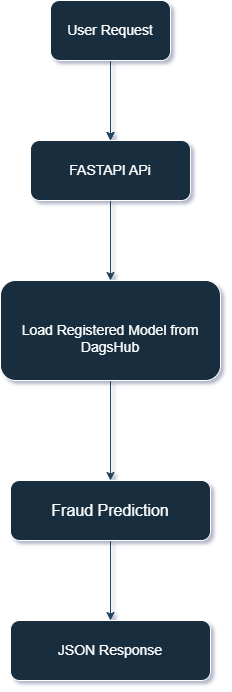

# End-to-End ML Platform for Financial Fraud Detection
# Overview

This project is a production-style machine learning system for detecting fraudulent financial transactions. The goal was to simulate a real-world ML workflow — from training a model, tracking experiments, to serving predictions via an API, all in a reproducible, containerized environment.

The project demonstrates how a machine learning model can be developed, tracked, containerized, and deployed using industry-grade tools and practices

## Dataset
The model is trained on historical financial transaction data containing numerical features and anonymized variables.  

- Public dataset reference: [Kaggle Credit Card Fraud Detection](https://www.kaggle.com/datasets/mlg-ulb/creditcardfraud)
- Data type: Numerical, anonymized features, and transaction amount/time.

## Model Input Features
- Transaction Amount  
- Transaction Time  
- Anonymized numerical features (V1–V28)

## What This Project Does

- Trains a fraud detection model on historical transaction data.
- Tracks experiments and model versions using **MLflow** integrated with **DagsHub**.
- Loads the **registered model directly from DagsHub** for inference.
- Serves the model through a **FastAPI REST API** for real-time predictions.
- Ensures reproducibility and environment consistency using **Docker**.
- Organized in a modular, **production-ready architecture**.

## Key Features

- End-to-end ML pipeline for fraud detection.
- Experiment tracking & model versioning with **MLflow + DagsHub**.
- Real-time predictions via **FastAPI API**.
- **Dockerized** environment for easy deployment.
- Modular project structure reflecting **production workflows**.

## Technology Stack

- Python – core language
- Pandas & NumPy – data handling & numerical computations
- Scikit-learn, XGBoost, LightGBM – machine learning models
- MLflow & DagsHub – experiment tracking & model versioning
- FastAPI – serving real-time predictions
- Docker – reproducible, containerized environment

## ML Pipeline Overview
<div align="center">
  
</div>

Step-by-step:

1. Transaction data is sent to the API endpoint
2. FastAPI formats and processes the input
3. The trained model is loaded from DagsHub’s registered models
4. Model generates predictions
5. Results are returned as structured JSON
6. All experiments and metrics are tracked in MLflow

## Project Structure
```
End-to-End-ML-Platform-for-Financial-Fraud-Detection/
│
├── Dagshub-MLflow/
│ └── Dagshub-Mlflow-Model-Registered.png                   # Screenshot of Model Registered in Dagshub 
│ └── Dagshub-Mlflow-Experiment-Dashboard.png               # Screenshot of Model Experiment in Dagshub 
├── app/
│ └── __init__.py                                           # empty init file
│ └── main.py                                               # FASTAPI API file including Dagshub credential to load Model from Dagshub
├── images/
│ └── ML_workflow_pipeline.png                              # Workflow pipeline diagram
├── .dockerignore
├── .gitignore
├── Dockerfile                                              # Docker configuration for containerized deployment
├── requirements.txt                                        # Python dependencies
├── End_to_End_ML_Platform_for_financial_Risk_Scoring.ipynb # Ipynb file include preprocessing,Model Training, Model Saving, MLflow  Experiments integrated with Dagshub
├── Final-output-High-risk.png                              # screenshot of JSON output of High Risk 
├── Final-output-Low-risk.png                               # Screenshot of JSON output of Low risk
└── README.md                                               # Project documentation
```

## Model Training

- Data preprocessing and feature engineering
- Model training & evaluation tracked in **MLflow**
- Models registered and versioned on **DagsHub**
- Inference uses the registered model from **DagsHub**, ensuring reproducibility and version control

## Running the Project Locally
### 1. Clone the repo:
```bash
git clone https://github.com/Ronakpatel36186/End-to-End-ML-Platform-for-Financial-Fraud-Detection.git
cd End-to-End-ML-Platform-for-Financial-Fraud-Detection
```

### 2. Install Dependencies:
```bash
pip install -r requirements.txt
```

### 3. Start the API:
```bash
uvicorn app.main:app --reload 
```
## Running with Docker

### 1. Build the Docker Image:
```bash 
docker build -t end-to-end-ml-platform-for-financial-fraud-detection-api .
```
### 2. Run the Container:
```bash
docker run -p 8000:8000 -e PORT=8000 end-to-end-ml-platform-for-financial-fraud-detection-api
```

### Test API example:
```bash 
curl -X 'POST' \
  'http://localhost:8000/predict' \
  -H 'accept: application/json' \
  -H 'Content-Type: application/json' \
  -d '{
  "features": {
  "Time": 472,
  "V1": -3.043540624,
  "V2": -3.157307121,
  "V3": 1.08846278,
 ...
  "V26": -0.145361715,
  "V27": -0.252773123,
  "V28": 0.035764225,
  "Amount": 529
}
}'

```

### Sample Response:
<pre markdown="1"> ```JSON 
{
  "prediction": 1,
  "risk": "High Risk"
}
``` </pre>

## Author

Ronak Miteshkumar Patel – Master’s in Computer Science, Lakehead University
I’m passionate about Machine Learning Engineering, Data Science, and building production-ready ML systems. This project demonstrates my ability to integrate experiment tracking, registered models, API deployment, and containerization in an end-to-end workflow.

